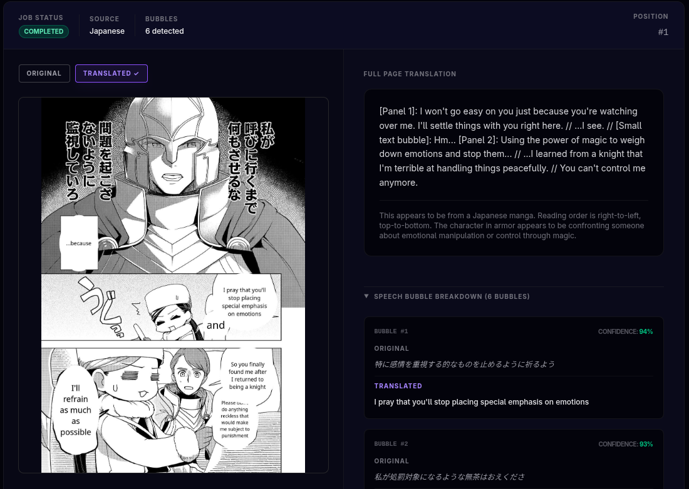
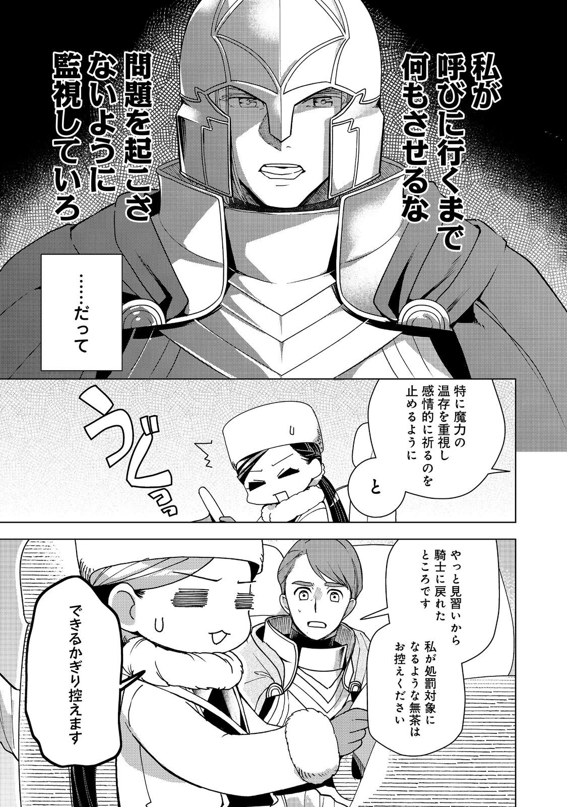

# Image Translator

A Rails application that translates text in manga, comics, and other images from Japanese (and other languages) to English using AI vision models. Upload an image, choose a provider, and get back a translated version with English text composited directly into the speech bubbles.

## Features

- **Multi-provider AI support** — Anthropic Claude, OpenAI GPT-4o, Google Gemini, and Ollama (local models)
- **Automatic speech bubble detection** — ONNX model finds bubble regions without manual annotation
- **Per-bubble translation** — each bubble is cropped, translated individually, and composited back onto the original image
- **Full-page translation** — plain-text translation of all page content alongside the visual output
- **Batch processing** — upload multiple images at once; jobs run in the background
- **Real-time UI** — Hotwire/Turbo polls job status and updates the page as translation progresses

## Tech Stack

- **Rails 8.1.3** — Propshaft, ImportMap, Turbo, Stimulus (no Node.js build step)
- **PostgreSQL** — 4 databases: primary, cache, queue, cable
- **Solid Queue** — database-backed background jobs (no Redis)
- **Active Storage** — image uploads and rendered output stored locally
- **ONNX Runtime** — runs the bubble detection model in-process
- **MiniMagick / ImageMagick** — image cropping and text compositing
- **Tailwind CSS v4**

## Prerequisites

- Ruby 4.x
- PostgreSQL
- ImageMagick (`magick` command available)
- libvips
- At least one AI provider API key (or Ollama running locally)

## Setup

```bash
# Install dependencies
bundle install

# Set up databases
bin/rails db:create db:migrate

# Create .env with your API keys
cp .env.example .env   # then edit with your keys
```

`.env` example:

```
ANTHROPIC_API_KEY=sk-ant-...
OPENAI_API_KEY=sk-...
GEMINI_API_KEY=AIza...
OLLAMA_BASE_URL=http://localhost:11434   # optional, defaults to this
```

## Running

```bash
bin/dev   # starts Rails + Tailwind watcher on port 3000
```

## Supported AI Providers

| Provider | Models | Notes |
|---|---|---|
| Anthropic | Claude Sonnet 4, Opus 4, Haiku 3.5 | Best overall quality |
| OpenAI | GPT-4o, GPT-4o mini, GPT-4 Turbo | Good quality |
| Google Gemini | Gemini 2.5 Flash, Gemini 2.5 Pro | Set `GEMINI_API_KEY` |
| Ollama | Moondream, LLaVA, LLaMA 3.2 Vision, Gemma3 | Local; requires Ollama running |

For Ollama, pull a model first:

```bash
ollama pull moondream   # smallest, ~1.7GB
ollama pull llava       # better quality, ~4.7GB, needs ~8GB free RAM for vision
```

## How It Works

1. User uploads one or more images and selects an AI provider/model
2. `TranslateImageJob` runs in the background for each image:
   - **Full-page translation** — the entire image is sent to the selected AI provider for a plain-text translation
   - **Bubble detection** — an ONNX YOLO model identifies speech bubble regions (stored as normalized bounding boxes)
   - **Per-bubble translation** — each bubble is cropped and sent individually to the AI provider
   - **Compositing** — translated text is rendered back onto the original image using ImageMagick (white ellipse fill + Noto Sans font)
3. The batch page auto-refreshes via Turbo and shows the rendered output when complete


### Examples and prints

<div>



| Raw Japanese | Translated to English |
| :---: | :---: |
| |  |
   
   
</div>

## Architecture

```
TranslationBatch          — groups one or more images, tracks provider/model
  └── TranslationJob      — one per uploaded image; has_one :rendered_image
        └── SpeechBubble  — one per detected bubble; stores bbox + translations

ImageTranslationService   — routes to the correct adapter
  ├── Translation::AnthropicAdapter
  ├── Translation::OpenaiAdapter
  ├── Translation::GeminiAdapter
  └── Translation::OllamaAdapter

BubbleDetectionService    — ONNX inference + NMS post-processing
BubbleTranslationService  — crops each bubble, calls adapter#translate_bubble_crop
ImageCompositorService    — draws translated text back onto the image
```

## Extending — Adding a New Provider

1. Add the provider to `TranslationBatch::PROVIDERS` (`app/models/translation_batch.rb`)
2. Create `app/services/translation/your_adapter.rb` inheriting from `Translation::BaseAdapter`
3. Implement **both** `call` (full-page) and `translate_bubble_crop` (per-bubble) — omitting either causes silent failures or `NotImplementedError`
4. Register the provider in `ImageTranslationService::ADAPTER_MAP`

Key constraints to preserve:
- `translate_bubble_crop` must be a **public** method, not inside `private`
- `BaseAdapter#parse_json` has a nil guard (`raise if raw.nil?`) — do not remove it; Gemini returns nil on safety-filtered responses
- Gemini 2.5-pro requires `maxOutputTokens: 2048` minimum — its thinking budget counts against the token limit, causing empty responses at 512
- Always use versioned Gemini model IDs (`gemini-2.5-flash`, not `gemini-2.0-flash`)

## Development Commands

```bash
bin/dev           # start dev server + Tailwind watcher
bin/ci            # full CI: rubocop + bundler-audit + brakeman
bin/rubocop       # lint
bin/brakeman      # security scan
bin/bundler-audit # gem CVE audit
```

## Environment Notes

- Credentials: `bin/rails credentials:edit` (never commit `config/master.key`)
- Solid Queue runs inside Puma in production (`SOLID_QUEUE_IN_PUMA=true`)
- The ONNX bubble detection model and Noto font path are configured in `config/initializers/ml_models.rb`
